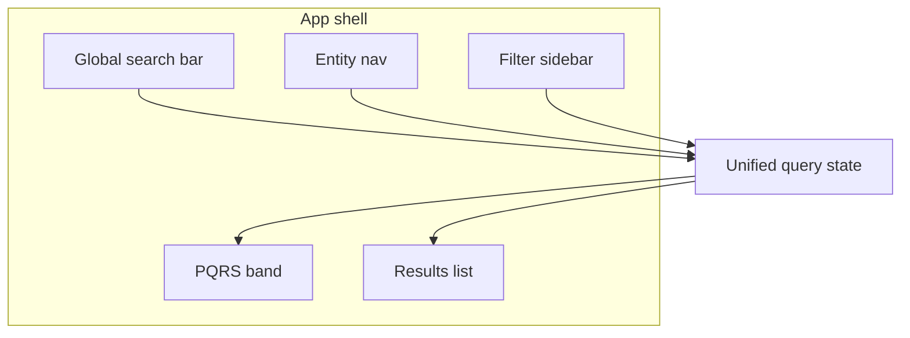
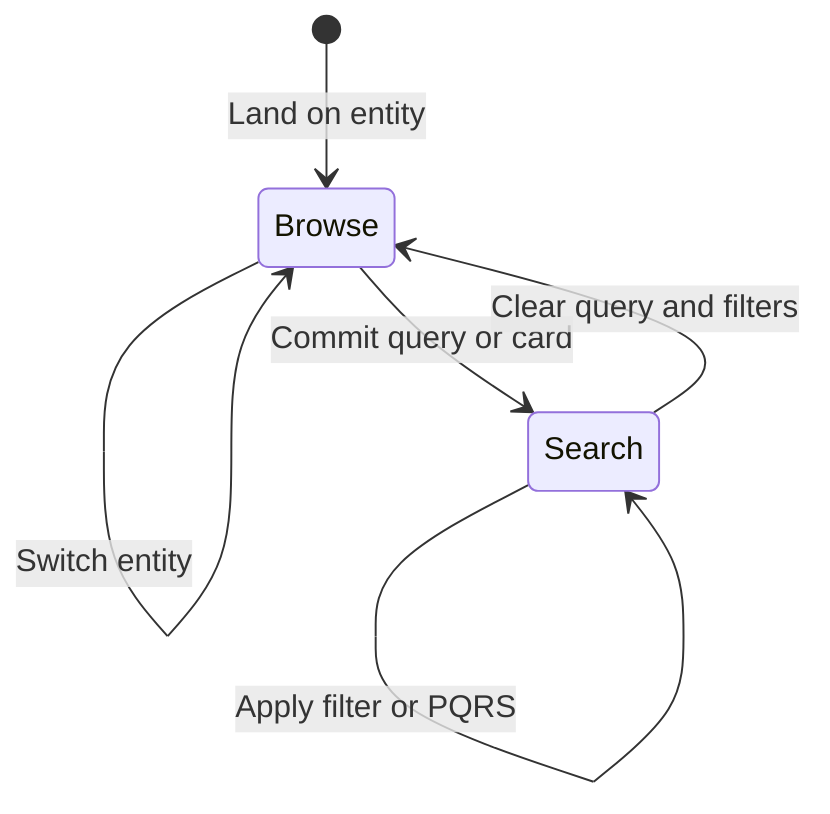
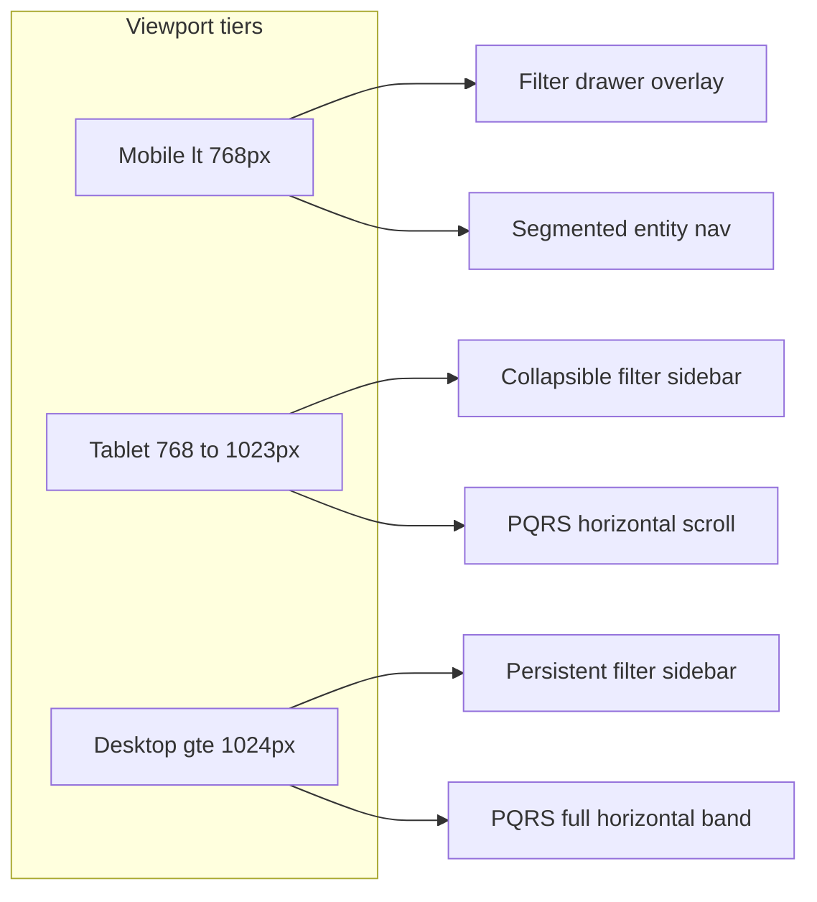

# MaNaReD — UX & Interaction Rationale

> **Scope: documentation & reference only**  
> This file records UX decisions and interaction rationale. It does **not** authorize code, component, or config changes. Do not modify `src/`, README, DESIGN.md, or other project files based on this doc unless explicitly asked to implement. Status fields like `not built` describe intent, not a pending task.

**This is the single document for UX design decisions and interaction rationale.**  
Add or revise decisions here for future reference. Do not duplicate rationale across README, DESIGN.md, or other files — link to this doc instead if needed.

|                     |                                                                                                 |
| ------------------- | ----------------------------------------------------------------------------------------------- |
| **Visual / tokens** | [`DESIGN.md`](./DESIGN.md)                                                                      |
| **Figma**           | [MaNaReD UI Library](https://www.figma.com/design/y12p7ety9bAbG9Z7m5Bd6L/MaNaReD?node-id=31-80) |
| **Stack / agents**  | [`AGENTS.md`](./AGENTS.md)                                                                      |

---

## How to use this document

Each section follows a consistent pattern:

- **Decision** — what we chose
- **Rationale** — why, and for whom
- **Rejected** — alternatives considered and dismissed
- **Interaction** — triggers, states, persistence, recovery
- **Status** — `decided` · `TBD` · `Figma TBD` · `not built`

Add notes, revise decisions, and mark status as the prototype evolves.

---

## 1. Product context

### Decision

MaNaReD is a specialized scientific data tool for marine natural products research (inspired by [CMNPD](https://www.cmnpd.org/)). The primary UX focus is the **search and filter interaction system**.

### Rationale

One interface serves two audiences without separate modes:

| Audience                                                                         | Needs                                                        |
| -------------------------------------------------------------------------------- | ------------------------------------------------------------ |
| Researchers (marine biologists, pharmacologists, ecologists, cheminformaticians) | Precise filtering, taxonomy navigation, reproducible queries |
| General public                                                                   | Discoverability, guided entry, understandable empty states   |

Complexity is progressive — curated entry points; depth available without an "expert mode."

### Rejected

- Separate UIs for researchers vs public
- Onboarding wizard before first search

**Status:** `decided`

---

## 2. Entity-first dual navigation

### Decision

Three **co-equal browse entities**: Compounds, Organisms, Regions.

**Dual nav:**

1. **Primary** — entity switcher (Compounds | Organisms | Regions)
2. **Secondary** — filter sidebar scoped to the active entity

A **unified query state** is shared between global search and the filter sidebar.

### Rationale

Entity choice determines result type, available filters, and card layout — but does not reset unrelated query intent (see [§8](#8-filter-state-persistence)).

| State field    | Source                              | Persists across entity switch?                      |
| -------------- | ----------------------------------- | --------------------------------------------------- |
| Text query     | Global search bar                   | Yes                                                 |
| Active filters | Filter sidebar                      | Partial — see [§8](#8-filter-state-persistence)     |
| Active entity  | Entity nav                          | Defines context                                     |
| Sort order     | Results header / implicit on search | Mode-dependent — see [§4](#4-browse-vs-search-mode) |
| Mode           | Derived (browse vs search)          | —                                                   |

### Interaction

- Entity switch updates filter set and result cards; valid filters persist with provenance
- Query state should sync to URL search params for shareability
- **Responsive:** segmented entity control (see [§11.1](#111-viewport-breakpoints)) — same three labels at all tiers; placement shifts by viewport

### Rejected

- Single undifferentiated result list without entity context
- Independent search and filter state objects
- Bottom tab bar for entities (conflicts with filter drawer and thumb reach for results)

**Status:** `decided` · **Figma:** `TBD`

---

## 3. Controlled-vocabulary search

### Decision

**Deterministic controlled-vocabulary search** — not AI or natural-language interpretation.

### Rationale

Scientific databases require verifiable, inspectable, shareable queries. Users must see exactly what produced a result set.

| Behavior | Specification                                       |
| -------- | --------------------------------------------------- |
| Input    | Typeahead against indexed vocabulary                |
| Display  | Active terms as removable chips/tags                |
| Sharing  | URL encodes full query state                        |
| Errors   | Unknown terms → inline validation (not silent drop) |

### Rejected

- NL / AI-interpreted search that hides query structure
- Free-text queries without decomposition into explicit filters/terms

**Status:** `decided`

---

## 4. Browse vs search mode

### Decision

Mode is **derived**, not user-toggled:

| Mode       | Entered when                                            | Filter sidebar                        | Sort           |
| ---------- | ------------------------------------------------------- | ------------------------------------- | -------------- |
| **Browse** | No text query; only default filters                     | Full list; entity-native order        | Entity default |
| **Search** | Query committed, card activated, or non-default filters | Reordered — relevant filters promoted | Relevance      |

### Rationale — contextual filter behavior in search mode

1. **Sidebar reordering** — query-correlated filters move to top
2. **MW range auto-narrowing** — slider adjusts to result set min/max (user can expand)
3. **Implicit relevance sorting** — on query entry, without manual sort change

### Interaction

- Reorder announced via `aria-live="polite"` — do not steal focus
- **Mobile (`<768px`):** promoted filters are not visible until the filter drawer opens — show a filter-activation affordance in the results header (e.g. "3 filters active · Edit") and lean on PQRS for discoverable refinements without opening the drawer

### Rejected

- Explicit "Browse / Search" mode toggle

**Status:** `decided`

---

## 4.1 Results view (card / list)

### Decision

Users can switch compound **results presentation** between **card** and **list** via an icon-only segmented control in the chip bar — **trailing control after Sort**.

| Setting          | Value                                                                                                                 |
| ---------------- | --------------------------------------------------------------------------------------------------------------------- |
| Control          | Two-segment icon toggle (Card \| List) — Astryx `SegmentedControl` or equivalent, styled with chip-bar control tokens |
| Placement        | Chip bar, far right after Sort — see Figma `chip-bar` (`349:3993`) + new `chip-bar/view-toggle` symbol (`TBD`)        |
| Default          | **Card** (browse-friendly; aligns with §10 initial browse posture)                                                    |
| Persistence      | User preference survives session; sync to URL (`?view=card` \| `?view=list`) when app ships (§10 URL principle)       |
| Scope            | Compound results first; organism/region list layouts `TBD` per entity                                                 |
| Browse vs search | **Independent** of browse/search derivation (§4) — user may use list in browse or card in search                      |
| Loading (future) | Skeleton shape matches active view (cards vs rows)                                                                    |

### Visual tokens (design system)

Composed from existing MaNaReD tokens — not a new visual language:

| Part             | Token / reference                                                                                                           |
| ---------------- | --------------------------------------------------------------------------------------------------------------------------- |
| Outer shell      | `chip-bar/more-filters` geometry — `h-7`, `shape.lg`, `border-border-secondary`, `bg-body` (`INTERACTIVE_CHIP_BAR_CONTROL`) |
| Selected segment | `MaNaReD.colour.interactive.button.active` — `bg-button-active`, `text-primary`                                             |
| Icons            | Figma Icons (`93:1469`) — 16px tier, `icon/card-view`, `icon/list-view`                                                     |
| Container        | Inline in `SURFACE_CHIP_BAR` gradient band                                                                                  |

Precedent: [`EntityNav`](src/app/components/manared/composites/entity-nav.tsx) — UX-only control built from Astryx + MaNaReD tokens.

### Responsive

Icon-only at all tiers. On mobile (`<768px`), may wrap to a second chip-bar row with More Filters and Sort — see [§11.1](#111-viewport-breakpoints).

### Rejected

- Auto-switching view when entering browse or search mode
- View control placed outside the chip bar (e.g. floating toolbar)

**Status:** `decided` · **Figma frame:** `TBD` (`chip-bar/view-toggle`) · **Visual tokens:** derived from chip-bar + interactive tokens

---

## 5. Filter pattern assignment by data shape

### Decision

UI control follows **data shape**, not visual preference:

| Data shape            | Control                   | Example fields                      | Entity             |
| --------------------- | ------------------------- | ----------------------------------- | ------------------ |
| Hierarchical taxonomy | Progressive filter (tree) | Organism taxonomy, region hierarchy | Organisms, Regions |
| Continuous numeric    | Range slider              | Molecular weight, year, depth       | Compounds, Regions |
| Bounded categorical   | Dropdown                  | Compound class, collection type     | Compounds          |
| Additive categorical  | Tag multi-select          | Bioactivity targets, assay types    | Compounds          |

### Rationale

Bioactivity is a **filter dimension** (tag multi-select), not a fourth browse entity. Figma token `MaNaReD.colour.entity.bioactivity` styles bioactivity badges on result cards and list rows — distinct from Compounds / Organisms / Regions nav.

**Colour split (sidebar vs results):**

| Surface                  | Token                               | Use                                                      |
| ------------------------ | ----------------------------------- | -------------------------------------------------------- |
| Filter sidebar tag pills | `MaNaReD.colour.entity.compound`    | Selected/unselected states in `tag-dropdown` (`166:998`) |
| Result badges / chips    | `MaNaReD.colour.entity.bioactivity` | Bioactivity labels on compound cards, list rows, PQRS    |

Sidebar filter tags intentionally use compound styling so additive filters read as constraint controls, not entity navigation.

**Bioactivity vs Target / assay:**

Two separate accordion rows in the filter sidebar (Figma `filter/container` `349:4572`). Both use the `tag-dropdown` pattern but different vocabularies:

| Category       | Example values                   | Semantics                          |
| -------------- | -------------------------------- | ---------------------------------- |
| Bioactivity    | Cytotoxic, Antiviral, Antifungal | Activity type — OR within category |
| Target / assay | MTT assay, DPPH, AChE inhibition | Assay method — OR within category  |

Categories are complementary: a user may select bioactivity constraints and assay constraints independently. Each category uses **OR** semantics (match any selected tag in that category).

**Facet counts:**

Tags show an inline count suffix when the current result set provides facet data (e.g. `Cytotoxic (48)`). Tags with count `0` are disabled and non-interactive. Counts refresh when the result set or other filters change.

**Large vocabulary:**

When a category has more than eight tags, show a compact search field above the tag row. Search filters the visible tag list client-side; it does not alter the text query.

### Interaction

- Sidebar background: `MaNaReD.colour.BG.sideBar` (`#F6FAFF`)
- Collapse: Figma `icon/vertical-collapse` (32px) at tablet tier ([§11.1](#111-viewport-breakpoints))
- Clear-all: explicit; does not clear text query unless "clear everything"
- **Active filter chips** (search bar + results header): see [§11.4](#114-filter-chips-and-provenance-on-narrow-viewports)
- Chip click on a bioactivity or target/assay chip reopens the sidebar and expands that category for editing

**Status:** `decided` · **Figma:** `compound-tag` (`166:925`), `tag-dropdown` (`166:998`), variant frames on component library page (`tag-dropdown/*`, `target-assay/*`)

---

## 6. Post-query refinement suggestions (PQRS)

### Decision

**PQRS** — suggestions derived from the **live result set**, surfaced **between the search bar and results**, not inside the filter panel.

### Rationale

| Filter sidebar             | PQRS band                             |
| -------------------------- | ------------------------------------- |
| User-initiated constraints | System-suggested refinements          |
| Persistent until cleared   | Ephemeral — refreshes with result set |
| Applies on user action     | One-click apply; never auto-applies   |

PQRS is exploratory ("given what you have, you might also want…"). Filters are intentional constraints.

### Interaction

| Action             | Effect                                        |
| ------------------ | --------------------------------------------- |
| Click suggestion   | Applies as filter or query term               |
| Dismiss            | Hidden until result set changes significantly |
| Result set changes | Suggestions refresh                           |

Derivation sources: facet counts, numeric clusters (e.g. MW), related vocabulary terms.

**Responsive (see [§11.3](#113-pqrs-by-viewport)):**

- Desktop: full horizontal band, wrap to second row if needed
- Tablet / mobile: single-row horizontal scroll with scroll-snap; no vertical wrap

### Rejected

- PQRS inside filter panel
- Auto-applying suggestions without user click

**Status:** `decided` · **Figma:** `TBD`

---

## 7. Empty states

### Decision

Three empty triggers — distinct tone and recovery per type:

| Trigger           | Cause                       | Tone    | Recovery                                            |
| ----------------- | --------------------------- | ------- | --------------------------------------------------- |
| **Filter-caused** | Filters exclude all results | Neutral | Remove filter X, clear all, per-filter counts       |
| **Query-caused**  | Text query matches nothing  | Helpful | Spelling variants, broader terms, vocabulary browse |
| **Data-gap**      | Valid query; no corpus data | Honest  | Explain coverage; no fake results                   |

### Interaction

- Empty message receives focus on transition (`tabindex="-1"`)
- **Mobile:** close filter drawer before moving focus to empty message (avoid focus trap behind overlay)
- Filter-caused recovery list scrolls inside drawer body if it exceeds viewport height

### Rejected

- Generic single empty state for all causes

**Status:** `decided` · **Figma:** `TBD`

---

## 8. Filter state persistence

### Decision

Filters **persist across entity switches** when semantically valid, with **explicit provenance signaling** for carried filters.

| Filter            | → Organisms     | → Regions          |
| ----------------- | --------------- | ------------------ |
| Bioactivity tags  | Yes             | Yes                |
| Organism taxonomy | Maps to context | May narrow results |
| MW range          | Dropped         | Dropped            |
| Region hierarchy  | Dropped         | Yes                |

### Interaction

Carried filters show provenance via a compact prefix on the chip label (e.g. `Compounds · MW 200–400`) — see [§11.4](#114-filter-chips-and-provenance-on-narrow-viewports). Cleared individually or via clear-all.

**Status:** `decided`

---

## 9. Home entry — curated query cards

### Decision

Home screen shows **curated pre-filtered query cards** — each is a **live database query**, not an onboarding step.

| Property | Specification                                         |
| -------- | ----------------------------------------------------- |
| Content  | Real result counts                                    |
| Action   | Activates search mode with card filters/query applied |
| Updates  | Skeleton while counts load                            |

**Responsive grid:**
| Viewport | Columns |
|----------|---------|
| Desktop `≥1024px` | 3 |
| Tablet `768–1023px` | 2 |
| Mobile `<768px` | 1 (stacked) |

### Rejected

- Static cards with fake numbers
- Multi-step onboarding before first search

**Status:** `decided` · card copy `TBD` · **Figma:** `TBD`

---

## 10. Defaults

| Setting        | Default                                                | Notes                                  |
| -------------- | ------------------------------------------------------ | -------------------------------------- |
| Landing entity | Compounds                                              | Confirm with usage data                |
| Initial mode   | Browse                                                 | Cards → search on activation           |
| Filter sidebar | Open at desktop; collapsed at tablet; drawer at mobile | See [§11.1](#111-viewport-breakpoints) |
| Entity nav     | Segmented control below search bar                     | Full-width at mobile                   |
| Sort (browse)  | TBD per entity                                         |                                        |
| Sort (search)  | Relevance                                              | Implicit on query entry                |
| URL            | Reflects all committed state                           | Shareability                           |

**Status:** `decided` (browse sort per entity still `TBD`)

---

## 11. Loading, error, responsive

### Loading

- Results: skeleton cards
- PQRS: hidden until first result set
- Filter counts: inline spinner; sidebar stays interactive

### Errors

- Network: retry banner; preserve query state
- Partial data: results + warning badge

### 11.1 Viewport breakpoints

Align with **Tailwind v4** (`sm` 640 · `md` 768 · `lg` 1024) and **Astryx AppShell** (`mobileNav={{ breakpoint: 'md' }}` — drawer activates below 768px).

| Tier        | Range          | Tailwind / Astryx  |
| ----------- | -------------- | ------------------ |
| **Mobile**  | `<768px`       | below `md`         |
| **Tablet**  | `768px–1023px` | `md` to below `lg` |
| **Desktop** | `≥1024px`      | `lg` and above     |

| Component      | Mobile `<768px`                                                                     | Tablet `768–1023px`                                  | Desktop `≥1024px`                                                 |
| -------------- | ----------------------------------------------------------------------------------- | ---------------------------------------------------- | ----------------------------------------------------------------- |
| Filter sidebar | Drawer overlay; filter icon in header opens it                                      | Collapsed by default; expand via `vertical-collapse` | Persistent, open by default                                       |
| Entity nav     | Segmented control, full width, below search bar                                     | Segmented control, inline below search bar           | Segmented control or inline with top bar                          |
| PQRS           | Horizontal scroll — [§11.3](#113-pqrs-by-viewport)                                  | Horizontal scroll                                    | Full band; wrap to second row if needed                           |
| Search + chips | Stacked; chips wrap — [§11.4](#114-filter-chips-and-provenance-on-narrow-viewports) | Chips wrap                                           | Chips inline with search                                          |
| Results view   | Icon toggle in chip bar; may wrap with other controls                               | Same                                                 | Trailing control after Sort — [§4.1](#41-results-view-card--list) |
| Home cards     | 1 column                                                                            | 2 columns                                            | 3 columns                                                         |

### 11.2 Entity nav on mobile

### Decision

**Segmented control** (three segments: Compounds | Organisms | Regions), placed **below the global search bar**, full width at mobile.

### Rationale

- Three co-equal entities fit a segmented control without a dropdown
- Keeps entity context visible while scrolling results (unlike bottom tabs, which compete with filter drawer and result reading)
- Same control pattern scales to tablet and desktop — only width and placement change

### Rejected

- Bottom tab bar (conflicts with filter drawer, obscures results)
- Entity dropdown (hides active entity; bad for wayfinding)
- Separate mobile-only nav pattern (inconsistent mental model)

**Status:** `decided`

### 11.3 PQRS by viewport

| Tier                    | Behavior                                                                                                                                                                                                                                  |
| ----------------------- | ----------------------------------------------------------------------------------------------------------------------------------------------------------------------------------------------------------------------------------------- |
| **Desktop `≥1024px`**   | Full horizontal band between search and results; chips wrap to a second row if more than one row fits                                                                                                                                     |
| **Tablet `768–1023px`** | Single-row **horizontal scroll** with `scroll-snap`; fade or shadow at trailing edge indicates more                                                                                                                                       |
| **Mobile `<768px`**     | Same as tablet: horizontal scroll, no vertical wrap; show **up to 2 visible chips** plus a **"+N more"** text control if more than 3 suggestions exist — tapping "+N more" expands inline to scrollable row (does not open filter drawer) |

**Rationale:** PQRS compensates on mobile when promoted sidebar filters are hidden in the drawer ([§4](#4-browse-vs-search-mode)). Scroll preserves scanability; "+N more" avoids a tall chip stack above results.

**Status:** `decided`

### 11.4 Filter chips and provenance on narrow viewports

Active query terms and carried filters render as **removable chips** in the search area and/or a results-header chip row.

| Behavior             | Specification                                                                                          |
| -------------------- | ------------------------------------------------------------------------------------------------------ |
| Layout               | **Wrap** to multiple lines (flex-wrap); never single-line truncate for the whole set                   |
| Provenance           | Inline prefix on label: `Compounds ·` + filter name — not a separate badge (saves horizontal space)    |
| Overflow             | After **2 wrapped rows**, collapse remaining chips behind **"+N filters"** control; tap expands inline |
| Removal              | Each chip has dismiss control; provenance prefix is non-interactive text                               |
| Drawer open (mobile) | Chips remain visible in header above drawer — user always sees active constraint count                 |

**Status:** `decided`

**Status (§11 overall):** `decided`

---

## 12. Future build order (reference — not active work)

Recommended sequence **if** implementation is explicitly requested later in [`src/app/`](./src/app/):

1. App shell (entity nav + layout)
2. Unified query state + URL sync (client island)
3. Filter sidebar per entity
4. Results list (mock data)
5. PQRS band
6. Home curated cards
7. Empty / loading / error states

Implement only when explicitly requested.

**Current code:** single `/` demo route — MaNaReD UX not yet built.

**Status:** `not built` (reference only)

---

## 13. Open questions

| #   | Question                               | Blocks         |
| --- | -------------------------------------- | -------------- |
| 1   | Default sort per entity in browse mode | Results header |
| 2   | Final curated card set and copy        | Home screen    |
| 3   | Data-gap "notify me" scope             | Empty state    |
| 4   | Screen frames in Figma                 | Visual design  |

---

## Appendix — review notes (2026-07-05)

Cross-reference findings when this document was first created. Use as a checklist; resolve items inline above as you document.

### Discrepancies to watch

| Topic               | Note                                                                                                    |
| ------------------- | ------------------------------------------------------------------------------------------------------- |
| **Bioactivity**     | Sidebar filter tags use `entity.compound`; result badges use `entity.bioactivity` — see §5 colour split |
| **Figma screens**   | UI Library (`31:80`) has tokens + icons only; screen layouts not yet designed                           |
| **README overlap**  | README lists the same eight decisions as bullets — this doc owns the full rationale                     |
| **DESIGN.md scope** | Tokens and implementation only; no interaction detail                                                   |

### Gaps filled in this document

- Unified query state model and diagram
- Browse vs search derived mode
- PQRS vs filter panel boundary
- Cross-entity persistence matrix
- Empty state taxonomy
- Defaults, loading, error, responsive tables
- Viewport breakpoints (768 / 1024), mobile entity nav, PQRS scroll, chip overflow
- Build order for prototype

### Your notes

<!-- Add research, competitive analysis, wireframe links, and revised decisions below -->
