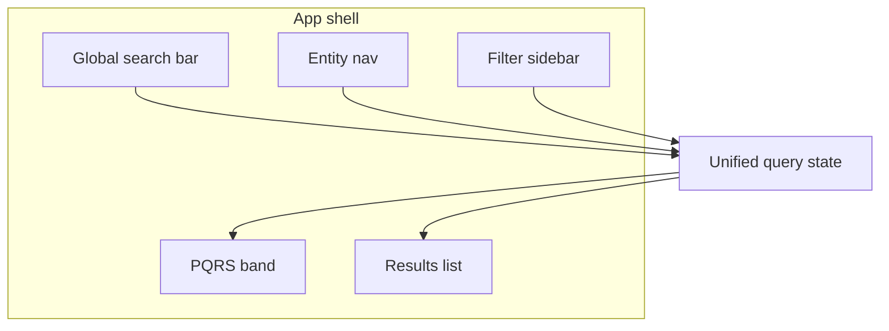
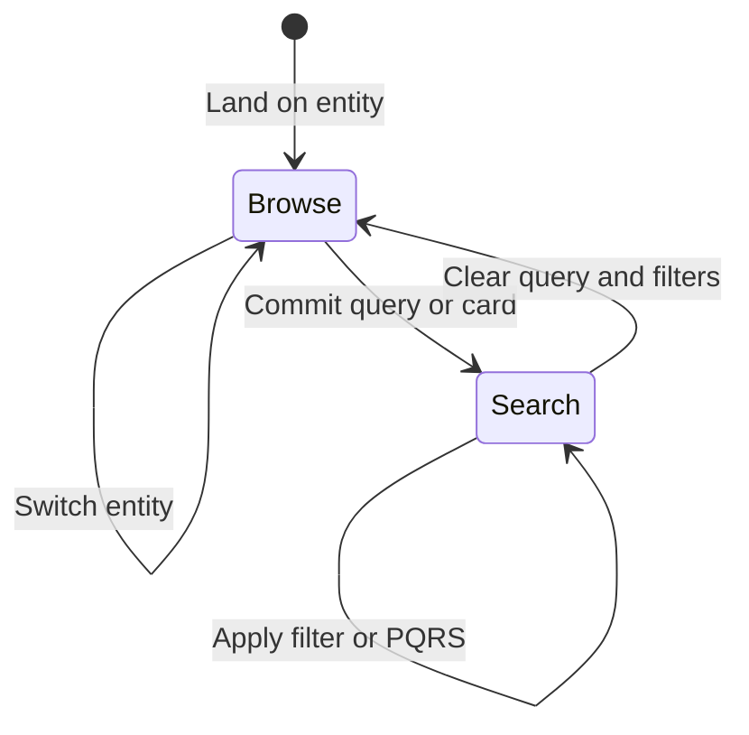

# MaNaReD — UX & Interaction Rationale

**This is the single document for UX design decisions and interaction rationale.**  
Document decisions here when building the prototype. Do not duplicate rationale across README, DESIGN.md, or other files — link to this doc instead if needed.

| | |
|---|---|
| **Visual / tokens** | [`DESIGN.md`](./DESIGN.md) |
| **Figma** | [MaNaReD UI Library](https://www.figma.com/design/y12p7ety9bAbG9Z7m5Bd6L/MaNaReD?node-id=31-80) |
| **Stack / agents** | [`AGENTS.md`](./AGENTS.md) |

---

## How to use this document

Each section follows a consistent pattern:

- **Decision** — what we chose
- **Rationale** — why, and for whom
- **Rejected** — alternatives considered and dismissed
- **Interaction** — triggers, states, persistence, recovery
- **Status** — `decided` · `TBD` · `Figma TBD` · `not built`

Add notes, revise decisions, and mark status as the prototype evolves.

---

## 1. Product context

### Decision

MaNaReD is a specialized scientific data tool for marine natural products research (inspired by [CMNPD](https://www.cmnpd.org/)). The primary UX focus is the **search and filter interaction system**.

### Rationale

One interface serves two audiences without separate modes:

| Audience | Needs |
|----------|-------|
| Researchers (marine biologists, pharmacologists, ecologists, cheminformaticians) | Precise filtering, taxonomy navigation, reproducible queries |
| General public | Discoverability, guided entry, understandable empty states |

Complexity is progressive — curated entry points; depth available without an "expert mode."

### Rejected

- Separate UIs for researchers vs public
- Onboarding wizard before first search

**Status:** `decided`

---

## 2. Entity-first dual navigation

### Decision

Three **co-equal browse entities**: Compounds, Organisms, Regions.

**Dual nav:**
1. **Primary** — entity switcher (Compounds | Organisms | Regions)
2. **Secondary** — filter sidebar scoped to the active entity

A **unified query state** is shared between global search and the filter sidebar.

### Rationale

Entity choice determines result type, available filters, and card layout — but does not reset unrelated query intent (see [§8](#8-filter-state-persistence)).

| State field | Source | Persists across entity switch? |
|-------------|--------|-------------------------------|
| Text query | Global search bar | Yes |
| Active filters | Filter sidebar | Partial — see [§8](#8-filter-state-persistence) |
| Active entity | Entity nav | Defines context |
| Sort order | Results header / implicit on search | Mode-dependent — see [§4](#4-browse-vs-search-mode) |
| Mode | Derived (browse vs search) | — |

### Interaction

- Entity switch updates filter set and result cards; valid filters persist with provenance
- Query state should sync to URL search params for shareability

### Rejected

- Single undifferentiated result list without entity context
- Independent search and filter state objects

**Status:** `decided` · **Figma:** `TBD`

---

## 3. Controlled-vocabulary search

### Decision

**Deterministic controlled-vocabulary search** — not AI or natural-language interpretation.

### Rationale

Scientific databases require verifiable, inspectable, shareable queries. Users must see exactly what produced a result set.

| Behavior | Specification |
|----------|---------------|
| Input | Typeahead against indexed vocabulary |
| Display | Active terms as removable chips/tags |
| Sharing | URL encodes full query state |
| Errors | Unknown terms → inline validation (not silent drop) |

### Rejected

- NL / AI-interpreted search that hides query structure
- Free-text queries without decomposition into explicit filters/terms

**Status:** `decided`

---

## 4. Browse vs search mode

### Decision

Mode is **derived**, not user-toggled:

| Mode | Entered when | Filter sidebar | Sort |
|------|--------------|----------------|------|
| **Browse** | No text query; only default filters | Full list; entity-native order | Entity default |
| **Search** | Query committed, card activated, or non-default filters | Reordered — relevant filters promoted | Relevance |

### Rationale — contextual filter behavior in search mode

1. **Sidebar reordering** — query-correlated filters move to top
2. **MW range auto-narrowing** — slider adjusts to result set min/max (user can expand)
3. **Implicit relevance sorting** — on query entry, without manual sort change

### Interaction

- Reorder announced via `aria-live="polite"` — do not steal focus

### Rejected

- Explicit "Browse / Search" mode toggle

**Status:** `decided`

---

## 5. Filter pattern assignment by data shape

### Decision

UI control follows **data shape**, not visual preference:

| Data shape | Control | Example fields | Entity |
|------------|---------|----------------|--------|
| Hierarchical taxonomy | Progressive filter (tree) | Organism taxonomy, region hierarchy | Organisms, Regions |
| Continuous numeric | Range slider | Molecular weight, year, depth | Compounds, Regions |
| Bounded categorical | Dropdown | Compound class, collection type | Compounds |
| Additive categorical | Tag multi-select | Bioactivity targets, assay types | Compounds |

### Rationale

Bioactivity is a **filter dimension** (tag multi-select), not a fourth browse entity. Figma token `MaNaReD.colour.entity.bioactivity` styles bioactivity badges — distinct from Compounds / Organisms / Regions nav.

### Interaction

- Sidebar background: `MaNaReD.colour.BG.sideBar` (`#F6FAFF`)
- Collapse: Figma `icon/vertical-collapse` (32px) on narrow viewports
- Clear-all: explicit; does not clear text query unless "clear everything"

**Status:** `decided` · **Figma:** `TBD`

---

## 6. Post-query refinement suggestions (PQRS)

### Decision

**PQRS** — suggestions derived from the **live result set**, surfaced **between the search bar and results**, not inside the filter panel.

### Rationale

| Filter sidebar | PQRS band |
|----------------|-----------|
| User-initiated constraints | System-suggested refinements |
| Persistent until cleared | Ephemeral — refreshes with result set |
| Applies on user action | One-click apply; never auto-applies |

PQRS is exploratory ("given what you have, you might also want…"). Filters are intentional constraints.

### Interaction

| Action | Effect |
|--------|--------|
| Click suggestion | Applies as filter or query term |
| Dismiss | Hidden until result set changes significantly |
| Result set changes | Suggestions refresh |

Derivation sources: facet counts, numeric clusters (e.g. MW), related vocabulary terms.

### Rejected

- PQRS inside filter panel
- Auto-applying suggestions without user click

**Status:** `decided` · **Figma:** `TBD`

---

## 7. Empty states

### Decision

Three empty triggers — distinct tone and recovery per type:

| Trigger | Cause | Tone | Recovery |
|---------|-------|------|----------|
| **Filter-caused** | Filters exclude all results | Neutral | Remove filter X, clear all, per-filter counts |
| **Query-caused** | Text query matches nothing | Helpful | Spelling variants, broader terms, vocabulary browse |
| **Data-gap** | Valid query; no corpus data | Honest | Explain coverage; no fake results |

### Interaction

- Empty message receives focus on transition (`tabindex="-1"`)

### Rejected

- Generic single empty state for all causes

**Status:** `decided` · **Figma:** `TBD`

---

## 8. Filter state persistence

### Decision

Filters **persist across entity switches** when semantically valid, with **explicit provenance signaling** for carried filters.

| Filter | → Organisms | → Regions |
|--------|-------------|-----------|
| Bioactivity tags | Yes | Yes |
| Organism taxonomy | Maps to context | May narrow results |
| MW range | Dropped | Dropped |
| Region hierarchy | Dropped | Yes |

### Interaction

Carried filters show provenance (e.g. "from Compounds" badge). Cleared individually or via clear-all.

**Status:** `decided` · provenance visual `TBD`

---

## 9. Home entry — curated query cards

### Decision

Home screen shows **curated pre-filtered query cards** — each is a **live database query**, not an onboarding step.

| Property | Specification |
|----------|---------------|
| Content | Real result counts |
| Action | Activates search mode with card filters/query applied |
| Updates | Skeleton while counts load |

### Rejected

- Static cards with fake numbers
- Multi-step onboarding before first search

**Status:** `decided` · card copy `TBD` · **Figma:** `TBD`

---

## 10. Defaults

| Setting | Default | Notes |
|---------|---------|-------|
| Landing entity | Compounds | Confirm with usage data |
| Initial mode | Browse | Cards → search on activation |
| Filter sidebar | Open desktop; collapsed narrow | |
| Sort (browse) | TBD per entity | |
| Sort (search) | Relevance | Implicit on query entry |
| URL | Reflects all committed state | Shareability |

**Status:** mostly `TBD`

---

## 11. Loading, error, responsive

### Loading
- Results: skeleton cards
- PQRS: hidden until first result set
- Filter counts: inline spinner; sidebar stays interactive

### Errors
- Network: retry banner; preserve query state
- Partial data: results + warning badge

### Responsive
| Viewport | Behavior |
|----------|----------|
| Desktop ≥1024px | Persistent sidebar |
| Tablet | Collapsible sidebar |
| Mobile | Drawer sidebar; entity nav pattern `TBD` |

**Status:** `decided` (mobile nav `TBD`)

---

## 12. Prototype build order

Recommended sequence when implementing in [`src/app/`](./src/app/):

1. App shell (entity nav + layout)
2. Unified query state + URL sync (client island)
3. Filter sidebar per entity
4. Results list (mock data)
5. PQRS band
6. Home curated cards
7. Empty / loading / error states

**Current code:** single `/` demo route — MaNaReD UX not yet built.

**Status:** `not built`

---

## 13. Open questions

| # | Question | Blocks |
|---|----------|--------|
| 1 | Default sort per entity in browse mode | Results header |
| 2 | Final curated card set and copy | Home screen |
| 3 | Mobile entity nav (tabs vs segmented) | Responsive shell |
| 4 | Data-gap "notify me" scope | Empty state |
| 5 | Provenance indicator visual | Filter chip |
| 6 | Screen frames in Figma | Visual design |

---

## Appendix — review notes (2026-07-05)

Cross-reference findings when this document was first created. Use as a checklist; resolve items inline above as you document.

### Discrepancies to watch

| Topic | Note |
|-------|------|
| **Bioactivity** | Figma has `entity.bioactivity` colour token — use for tags, not as a fourth nav entity |
| **Figma screens** | UI Library (`31:80`) has tokens + icons only; screen layouts not yet designed |
| **README overlap** | README lists the same eight decisions as bullets — this doc owns the full rationale |
| **DESIGN.md scope** | Tokens and implementation only; no interaction detail |

### Gaps filled in this document

- Unified query state model and diagram
- Browse vs search derived mode
- PQRS vs filter panel boundary
- Cross-entity persistence matrix
- Empty state taxonomy
- Defaults, loading, error, responsive tables
- Build order for prototype

### Your notes

<!-- Add research, competitive analysis, wireframe links, and revised decisions below -->

