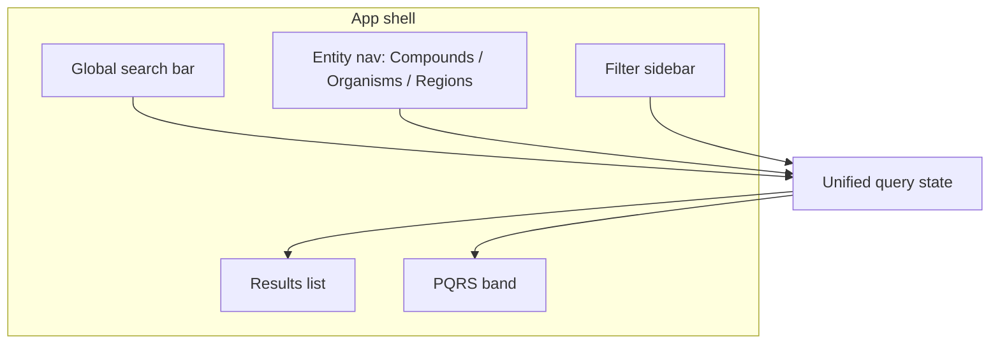
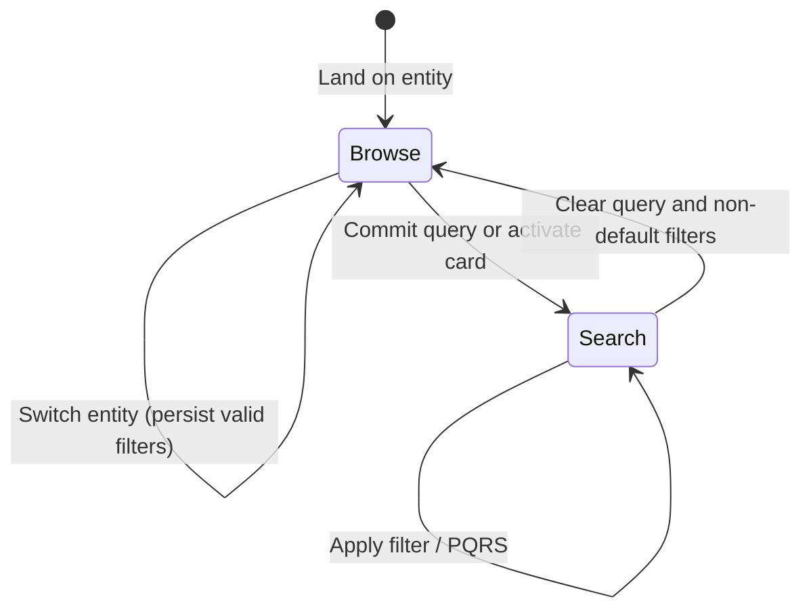

# MaNaReD UX Design Decisions

Interaction rationale and design decisions for building the MaNaReD prototype. This document is the canonical reference for *why* the search and filter system behaves as it does. Visual token mapping and implementation stack details live in [`DESIGN.md`](../DESIGN.md).

**Audience:** Future implementers, design reviewers, and agents building screens from Figma.

**Source archive:** Original decision bullets preserved in [`doc_archive/key-decisions-source.md`](../doc_archive/key-decisions-source.md).

---

## 1. Product context

### What MaNaReD is

MaNaReD (Marine Natural Products Database) is a portfolio UX project for a specialized scientific data tool inspired by [CMNPD](https://www.cmnpd.org/). The primary focus is the **search and filter interaction system**.

### Dual audience, single interface

| Audience | Needs | Design constraint |
|----------|-------|-------------------|
| **Researchers** (marine biologists, pharmacologists, ecologists, cheminformaticians) | Precise filtering, taxonomy navigation, reproducible queries | Must not dumb down controls |
| **General public** | Discoverability, guided entry, understandable empty states | Must not require domain expertise to start |

Both audiences share one interface. Complexity is progressive — entry points are curated; depth is available without mode-switching or separate "expert" UI.

### Scientific verifiability

MaNaReD is a **database**, not a language model. Queries must be deterministic, inspectable, and shareable. Users (and reviewers) can see exactly what filters and terms produced a result set.

**Rejected:** Natural-language or AI-interpreted search that hides the underlying query structure.

---

## 2. Information architecture

### Entity-first dual navigation

Three entity types are **co-equal browse destinations**:

| Entity | Role |
|--------|------|
| **Compounds** | Chemical structures and properties (e.g. molecular weight, formula) |
| **Organisms** | Source species and taxonomy |
| **Regions** | Geographic / marine collection context |

**Dual nav** means:

1. **Primary nav** — entity switcher (Compounds | Organisms | Regions)
2. **Secondary nav** — filter sidebar scoped to the active entity

Entity choice determines default result type, available filter set, and card/detail layout — but does **not** reset unrelated query intent (see [§7 State and persistence](#7-state-and-persistence)).

### Unified query state

Global search, entity context, active filters, sort order, and text query share a **single query state object**. The search bar and filter sidebar are two views onto the same state — not independent systems.

**Implementation note:** Reflect query state in URL search params for shareability and back/forward support. Filter sidebar and search bar should live in a client island (or coordinated islands) that sync to the URL; result lists can be Server Components fed by parsed params.

| State field | Source | Persists across entity switch? |
|-------------|--------|-------------------------------|
| Text query | Global search bar | Yes |
| Active filters | Filter sidebar | Partial — see [§7](#7-state-and-persistence) |
| Active entity | Entity nav | N/A (defines context) |
| Sort order | Results header / implicit on search | Mode-dependent — see [§4](#4-browse-vs-search-mode) |
| Mode | Derived (browse vs search) | — |

**Figma status:** Screen frames for entity nav and results layout are **TBD** — UI Library (`31:80`) currently documents tokens and icons only.

---

## 3. Search and query model

### Controlled-vocabulary search

Search operates on a **controlled vocabulary** — known field names, taxonomy nodes, compound identifiers, and categorical values. Autocomplete and suggestions draw from indexed vocabulary, not generative interpretation.

| Behavior | Specification |
|----------|---------------|
| Input | Typeahead against vocabulary; explicit term selection or Enter to commit |
| Display | Active query terms visible as removable chips/tags |
| Sharing | URL encodes full query state |
| Errors | Unknown terms surface inline validation — not silent drop |

**Why:** Researchers need to cite and reproduce queries. Public users benefit from visible structure ("this is what I searched for").

**Rejected:** Free-text NL queries ("find anticancer compounds from sponges") without decomposition into explicit filters/terms.

### Defaults (prototype)

| Setting | Default | Rationale |
|---------|---------|-----------|
| Landing entity | Compounds | Highest traffic in comparable DBs (CMNPD) |
| Initial mode | Browse | Home cards transition into search mode on activation |
| Filter sidebar | Open on desktop; collapsed on narrow viewports | Maximizes discoverability without crowding results |
| Sort (browse) | Recency or alphabetical per entity — **TBD** | Confirm with sample data |
| Sort (search) | Relevance (implicit on query entry) | See [§4](#4-browse-vs-search-mode) |
| URL reflectivity | All committed filters and query terms | Shareability |

---

## 4. Browse vs search mode

Mode is **derived**, not toggled by the user:

| Mode | Entered when | Filter sidebar behavior | Sort |
|------|--------------|------------------------|------|
| **Browse** | No text query and only default/preset filters | Full filter list; entity-native ordering | Entity default |
| **Search** | Text query committed OR curated card activated OR non-default filter set | Reordered — query-relevant filters promoted | Relevance |

### Contextual filter behavior in search mode

When the user enters search mode:

1. **Sidebar reordering** — filters most correlated with the active query move to the top
2. **MW range auto-narrowing** — molecular weight slider range adjusts to the min/max of the current result set (user can expand manually)
3. **Implicit relevance sorting** — results reorder on query entry without requiring a sort control change

**Rationale:** Reduces noise after a query narrows the corpus; keeps refinement controls near the result context.

**Accessibility:** Reordering must not move focus unexpectedly — announce reorder via `aria-live="polite"` region in the sidebar.

---

## 5. Filter system

### Pattern assignment by data shape

Each filter type maps to a UI control based on the underlying data shape — not visual preference.

| Data shape | Control | Example fields | Entity |
|------------|---------|----------------|--------|
| Hierarchical taxonomy | Progressive filter (tree / drill-down) | Organism taxonomy, region hierarchy | Organisms, Regions |
| Continuous numeric | Range slider (dual-handle) | Molecular weight, year, depth | Compounds, Regions |
| Bounded categorical | Dropdown (single or multi) | Compound class, collection type | Compounds |
| Additive categorical | Tag-based multi-select | Bioactivity targets, assay types | Compounds (cross-cutting) |

**Note on bioactivity:** Bioactivity is a **filter dimension** (tag multi-select), not a fourth top-level entity. Figma defines `MaNaReD.colour.entity.bioactivity` for badge styling on bioactivity tags — distinct from the three browse entities (Compounds, Organisms, Regions).

### Filter sidebar layout

- Background: `MaNaReD.colour.BG.sideBar` (`#F6FAFF`) — see [`DESIGN.md`](../DESIGN.md)
- Collapse control: Figma `icon/vertical-collapse` (32px) on narrow viewports
- Clear-all: explicit control; does not clear text query unless user chooses "clear everything"

### PQRS vs filter panel boundary

| Belongs in filter sidebar | Belongs in PQRS band |
|---------------------------|----------------------|
| User-initiated constraints | System-suggested refinements from live results |
| All filter types in §5 table | Aggregated facets (e.g. "82% of results are from Porifera") |
| Persistent until cleared | Ephemeral — updates when result set changes |
| Applies on user action | One-click apply; does not auto-apply |

**Rationale:** Filters are intentional user constraints. PQRS is exploratory — "given what you have, you might also want…" — and must not clutter the sidebar or auto-modify query state.

---

## 6. Post-query refinement suggestions (PQRS)

### Placement

PQRS renders **between the search bar and the results list** — a horizontal band of suggestion chips/cards.

### Derivation

Suggestions are computed from the **live result set** after each query/filter change:

- Facet counts (taxonomy, region, bioactivity prevalence)
- Numeric distribution hints (e.g. MW cluster)
- Related vocabulary terms not yet in the query

### Interaction

| Action | Effect |
|--------|--------|
| Click suggestion | Applies as filter or query term; suggestion moves to active state in sidebar/search |
| Dismiss | Removes suggestion until result set changes significantly |
| Result set changes | Suggestions refresh; stale suggestions drop |

**Rejected:** PQRS inside the filter panel (competes with intentional filtering) or auto-applying suggestions without user click.

**Figma status:** PQRS band layout **TBD**.

---

## 7. State and persistence

### Cross-entity filter persistence

When switching entities (e.g. Compounds → Organisms), filters that are **semantically valid** for the new entity persist; invalid filters drop with explanation.

| Filter | Carries to Organisms? | Carries to Regions? |
|--------|----------------------|---------------------|
| Bioactivity tags | Yes (if applicable) | Yes (if applicable) |
| Organism taxonomy | Maps to organism context | May narrow region-related results |
| MW range | N/A (compound-specific) | No — dropped |
| Region hierarchy | No — dropped | Yes |

### Provenance signaling

Carried filters display a **provenance indicator** (e.g. "from Compounds" badge or muted label) so users understand why an unexpected filter is active. Cleared individually or via clear-all.

---

## 8. Empty states

Three distinct empty triggers — each with different tone and recovery:

| Trigger | Cause | Tone | Recovery actions |
|---------|-------|------|------------------|
| **Filter-caused** | Active filters exclude all results | Neutral, informative | "Remove filter X", "Clear all filters", show count per filter contribution |
| **Query-caused** | Text query matches nothing | Helpful | Suggest spelling variants, broader terms, link to vocabulary browse |
| **Data-gap** | Valid query but no data in corpus | Honest, scientific | Explain coverage limits; no fake results; optional "notify when available" **TBD** |

**Accessibility:** Empty state message receives focus on transition (`tabindex="-1"`) so screen readers announce the new state.

**Figma status:** Empty state illustrations/copy **TBD**.

---

## 9. Home entry — curated query cards

The home screen presents **curated pre-filtered query cards** — each card is a **live database query**, not an onboarding tutorial step.

| Property | Specification |
|----------|---------------|
| Content | Real result counts from current data |
| Action | Activates search mode with card's filters/query pre-applied |
| Updates | Counts refresh on data load — stale counts show loading skeleton |
| Examples | "Anticancer compounds from sponges", "Peptides from Arctic regions" — **TBD final set** |

**Rejected:** Static marketing cards with fake numbers; multi-step onboarding wizard before first search.

**Figma status:** Home screen layout **TBD**.

---

## 10. Loading, error, and responsive behavior

### Loading

- Results area: skeleton list matching entity card shape
- PQRS: hidden until first result set resolves
- Filter counts: show spinner inline; do not block sidebar interaction

### Errors

- Network failure: retry banner above results; preserve query state
- Partial data: show results with warning badge; do not clear filters

### Responsive

| Viewport | Behavior |
|----------|----------|
| Desktop (≥1024px) | Sidebar persistent; PQRS horizontal scroll if needed |
| Tablet | Sidebar collapsible via `icon/vertical-collapse` |
| Mobile | Sidebar as overlay/drawer; entity nav as segmented control or bottom tabs — **TBD** |

---

## 11. Implementation mapping (prototype)

Current repo state vs this document:

| UX area | Documented here | Implemented in code |
|---------|-----------------|---------------------|
| Entity nav | §2 | Not yet — single `/` demo route |
| Unified query state | §2, §7 | Not yet |
| Filter sidebar | §5 | Not yet |
| PQRS | §6 | Not yet |
| Home query cards | §9 | Not yet |
| Design tokens | [`DESIGN.md`](../DESIGN.md) | Partial — neutral Astryx theme on demo home |

**Recommended build order:**

1. App shell (entity nav + layout)
2. Unified query state + URL sync (client island)
3. Filter sidebar per entity
4. Results list (mock data)
5. PQRS band
6. Home curated cards
7. Empty / loading / error states

**Stack pattern:** Server Component pages + `"use client"` islands for search, filters, and PQRS — see [`DESIGN.md` §7](../DESIGN.md).

---

## 12. Open questions

| # | Question | Blocks |
|---|----------|--------|
| 1 | Default sort per entity in browse mode | Results header UI |
| 2 | Final curated card set and copy | Home screen |
| 3 | Mobile entity nav pattern (tabs vs segmented) | Responsive shell |
| 4 | Data-gap "notify me" feature scope | Empty state design |
| 5 | Exact provenance indicator visual (badge vs label) | Filter chip component |
| 6 | Screen frames in Figma | Visual design pass |

---

## 13. Related docs

| Doc | Purpose |
|-----|---------|
| [`README.md`](../README.md) | Project overview and quick decision index |
| [`DESIGN.md`](../DESIGN.md) | Figma tokens, Astryx mapping, MCP workflow |
| [`doc_archive/`](../doc_archive/) | Source decision archive |
| [`docs/UX-REVIEW-NOTES.md`](./UX-REVIEW-NOTES.md) | Cross-reference review, discrepancies, improvements applied |
| [MaNaReD Figma UI Library](https://www.figma.com/design/y12p7ety9bAbG9Z7m5Bd6L/MaNaReD?node-id=31-80) | Visual source of truth (tokens + icons; screens TBD) |
